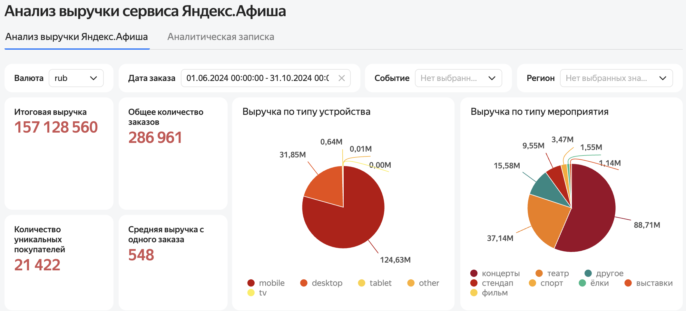
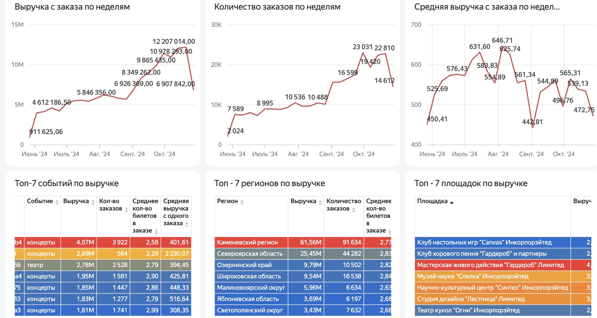

# Анализ данных сервиса Яндекс Афиша

Как меняется спрос на мероприятия при переходе от лета к осени и чем поведение
мобильных пользователей отличается от десктопных — исследование на 290 849 заказах
билетов за пять месяцев.

Проект состоит из двух частей: **дашборд выручки** для регулярного мониторинга
и **исследование в Python** с проверкой гипотез.

**Стек:** Python · pandas · Matplotlib · Seaborn · SciPy · Yandex DataLens

### 🔗 [Открыть интерактивный дашборд](https://datalens.yandex/9svky529f6sks)



---

## Контекст

Билетный сервис планирует осенний сезон. Чтобы решить, куда направлять маркетинговый
бюджет и как выстраивать работу с партнёрами, нужно понять три вещи: как смещается
структура спроса к осени, какие категории и регионы дают выручку и есть ли смысл
разделять коммуникацию для мобильных и десктопных пользователей.

**Задача:** выявить изменения пользовательских предпочтений осенью 2024 года
и статистически проверить гипотезы о различиях между типами устройств.

## Данные

| | |
|---|---|
| Период | 01.06.2024 — 31.10.2024 (5 месяцев) |
| Заказов | 290 849 |
| Мероприятий | 22 427 |

Три источника: заказы билетов (устройство, выручка, количество билетов, интервал
между покупками), справочник мероприятий (тип, организатор, регион, площадка)
и курс валют для приведения сумм к рублю.

## Подход

| Этап | Что сделано |
|---|---|
| Предобработка | Приведение типов, единая валюта, отсечение выбросов по 99-му перцентилю, обработка неявных дубликатов |
| Инжиниринг признаков | Временные признаки: месяц оформления заказа, сезон |
| Исследовательский анализ | Сезонность спроса, осенняя активность по дням недели, разрезы по категориям, регионам и партнёрам |
| Статистическая проверка | Две гипотезы о различиях мобильных и десктопных пользователей, t-тест |
| Визуализация | Дашборд выручки в DataLens с фильтрами по валюте, дате, событию и региону |

## Дашборд выручки

Две вкладки: интерактивный дашборд с фильтрами по валюте, дате, событию и региону
и аналитическая записка с выводами. [Открыть](https://datalens.yandex/9svky529f6sks)

| Показатель | Значение |
|---|---:|
| Итоговая выручка | 157,1 млн ₽ |
| Заказов | 286 961 |
| Уникальных покупателей | 21 422 |
| Средняя выручка с заказа | 548 ₽ |



**Что показывает дашборд**

- **Мобильные дают ~80 % выручки** — 124,63 млн ₽ против 31,85 млн ₽ у десктопа.
  Планшеты и остальные устройства дают доли процента.
- **Концерты — главный источник денег:** 88,71 млн ₽ и 112,4 тыс. заказов,
  самый дорогой средний билет — 297 ₽. Театр второй: 37,14 млн ₽,
  67,7 тыс. заказов, средний билет 199 ₽.
- **Выручка выросла в 13 раз за период:** с 0,9 млн ₽ на первой неделе июня
  до 12,2 млн ₽ на пике октября. При этом средний чек колеблется
  в узком коридоре 442–647 ₽ — рост идёт за счёт количества заказов, а не цены.
- **Регионы концентрированы:** Каменевский — 61,56 млн ₽, Североярская область —
  25,45 млн ₽. Вместе больше половины выручки.

## Результаты исследования

**Спрос вырос втрое и изменил структуру.** Заказы выросли с 34 171 в июне
до 99 291 в октябре. К осени доля театра поднялась с 20 % до 26 %, спорта — на 10 %,
концертов — упала примерно на 10 %.

**Театр — проблемная зона.** Единственная категория, где доля заказов растёт,
а выручка на билет падает, причём сильно: −17,47 %. У концертов падение ещё резче,
−35,47 %, но там снижается и доля. Растут выставки (+3,36 %) и стендап (+4,49 %).

**Будни обгоняют выходные:** 25 582 заказа против 20 368.

**Высокая концентрация — и по регионам, и по партнёрам.** Три региона дают больше
половины заказов: Каменевский (31,16 %), Североярская (15,2 %), Широковская (5,62 %).
Четыре партнёра дают больше половины выручки. Это операционный риск.

### Проверка гипотез

| Гипотеза | Результат | Мобильные | Десктоп |
|---|---|---:|---:|
| Мобильные пользователи активнее | Подтверждена, `p < 0.001` | 9,46 заказа | 7,04 заказа |
| Интервал между заказами больше у мобильных | Подтверждена, `p < 0.001` | 3,78 дня | 3,02 дня |

Мобильные пользователи делают на 34 % больше заказов, но с более длинным интервалом
между покупками — то есть это не импульсные покупки «на ходу», а другой режим
использования сервиса.

## Рекомендации

1. **Работа с сезонностью спроса.** Спрос в октябре идёт на спад — в этот период
   стоит вводить акции и скидки, чтобы сгладить падение
2. **Улучшение мобильного канала.** Большинство покупок идёт со смартфонов:
   оптимизировать мобильный интерфейс, упростить оформление заказа,
   настроить push-уведомления для повторных продаж
3. **Лояльность покупателей.** При 21,4 тыс. уникальных покупателей важно
   развивать повторные покупки — программы лояльности, персональные подборки
4. **Театральный сегмент** требует отдельного разбора: доля заказов растёт,
   а выручка на билет падает
5. **Снизить концентрацию** — развивать регионы за пределами топ-3 и расширять
   партнёрскую базу

## Структура репозитория

```
.
├── README.md
├── yandex_afisha_analysis.ipynb    — исследование в Python
├── dashboard-overview.png          — дашборд: KPI и структура выручки
└── dashboard-dynamics.png          — дашборд: динамика и топ-7
```

---

<sub>Данные предоставлены в рамках образовательной программы и не публикуются;
названия регионов и партнёров в датасете обезличены.</sub>
